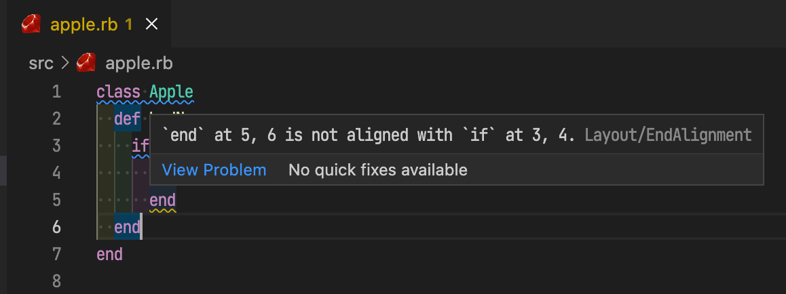
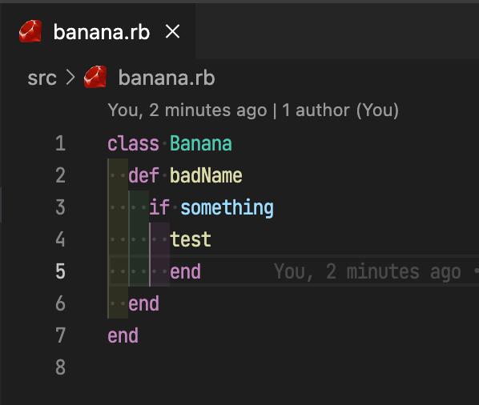
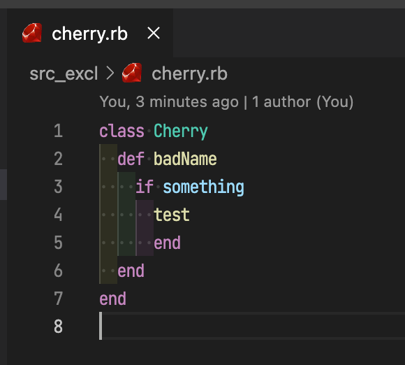

# Minimum Ruby Development Environment on VSCode with Ruby Extension integrated with Rubocop

This repository is minimumu sample project for VSCode Ruby Extension.
It shows how VSCode is integrated with Ruby Extension and Rubocop.

## Out of Container (Just on Host machine)

`apple.rb` is included for Rubocop, so violations are shown in the editor.

`banana.rb`, `cherry.rb` are excluded, so violation is not shown in the editor.

